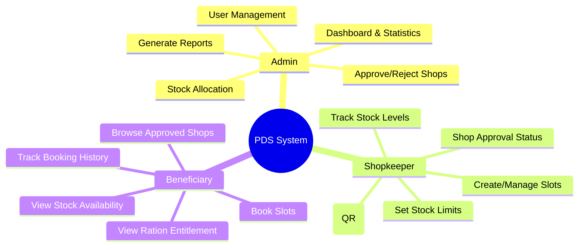
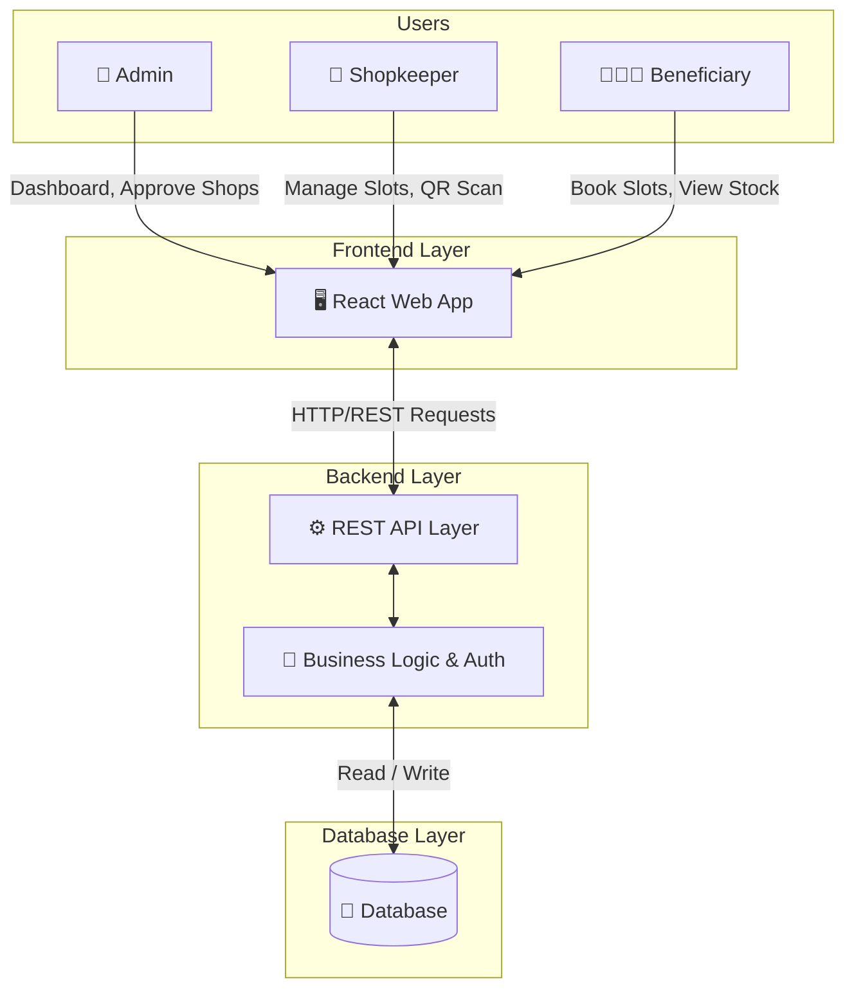
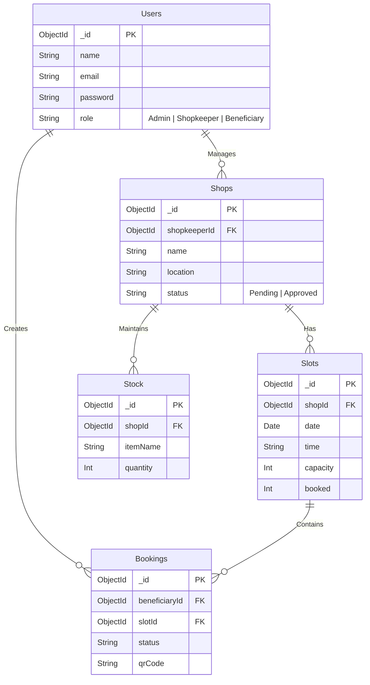

# PDS Slot Booking System

## Project Description

The PDS Slot Booking System is a comprehensive web application designed to streamline the distribution of rations across fair price shops in India. It aims to solve the widespread problem of long queues and waiting times in ration shops by allowing beneficiaries to pre-book convenient time slots for collecting their entitlements. Through an organized scheduling and stock tracking mechanism, the system ensures a transparent, efficient, and hassle-free experience for both beneficiaries and shopkeepers.

## Features

### 🧠 System Roles Mindmap
L


### 🔐 Three User Roles

1. **Admin** - System administrator
2. **Shopkeeper** - Fair price shop operators
3. **Beneficiary** - Ration card holders

### 📋 Functionality by Role

#### Admin Features
- View system-wide dashboard with statistics
- Approve or reject shop registrations
- Manage stock allocation to shops
- User management (CRUD operations)
- Generate reports with filters

#### Shopkeeper Features
- View shop approval status
- Create and manage time slots
- Set per-slot stock limits
- Track stock levels
- Verify beneficiary bookings using QR codes

#### Beneficiary Features
- Browse approved shops
- View real-time stock availability
- Book slots through 3-step process
- View auto-calculated ration entitlement
- Access QR codes for bookings
- Track booking history

## Demo Credentials

Use these credentials to test different user roles:

```
Admin:
Email: admin@pds.gov.in
Password: admin123

Shopkeeper:
Email: ram@gmail.com
Password: 12345678

Beneficiary:
Email: ponnanarohit507@gmail.com
Password: 12345678
```

## User Flows

### Beneficiary Flow
1. Login/Register as beneficiary
2. Browse approved shops on home page
3. View shop details and stock availability
4. Book a slot (3 steps):
   - Select date
   - Select time slot
   - Confirm booking with entitlement preview
5. View booking confirmation with QR code
6. Access booking history with expandable QR codes

### Shopkeeper Flow
1. Login/Register as shopkeeper
2. View dashboard (status, stock, bookings)
3. Create slots with stock limits
4. Monitor stock overview
5. Verify beneficiary bookings by scanning QR codes

### Admin Flow
1. Login as admin
2. View system dashboard
3. Approve/reject shop registrations
4. Allocate stock to approved shops
5. Manage users
6. Generate and filter reports

## System Architecture



## Database Schema



## API Endpoints

### 🔐 Authentication (`/api/auth`)
- `POST /login` - Authenticate user
- `POST /register` - Register new user (Admin, Shopkeeper, or Beneficiary)

### 🧑‍🤝‍🧑 Users (`/api/users`)
- `GET /` - Get all users (Admin only)
- `PUT /:id` - Update user details
- `DELETE /:id` - Delete a user

### 🏪 Shops (`/api/shops`)
- `GET /` - Get all shops
- `GET /:id` - Get shop by ID
- `GET /by-shopkeeper/:userId` - Get shop(s) for a specific shopkeeper
- `POST /` - Register a new shop
- `PUT /:id` - Update shop status/details

### 📅 Slots (`/api/slots`)
- `GET /` - Get all available slots
- `GET /shop/:shopId` - Get slots for a specific shop
- `POST /` - Create a new slot
- `PUT /:id` - Update slot capacity or details

### 🎫 Bookings (`/api/bookings`)
- `GET /` - Get all bookings
- `GET /user/:userId` - Get booking history for a user
- `GET /shop/:shopId` - Get all bookings for a specific shop
- `POST /` - Create a new booking

## Folder Structure

```text
pds-slot-booking-system/
├── backend/                  # Node.js + Express Backend
│   ├── config/               # Database and environment configurations
│   ├── models/               # Mongoose schemas (User, Shop, Slot, Booking)
│   ├── routes/               # Express API routes
│   └── server.js             # Main backend application entry point
├── public/                   # Static assets
└── src/                      # React Frontend Source
    ├── api/                  # Axios configurations and service files
    ├── app/                  # Main Application logic
    │   ├── components/       # Reusable UI elements
    │   ├── pages/            # Core views (Admin, Shopkeeper, Beneficiary flows)
    │   ├── types/            # TypeScript interfaces and types
    │   └── utils/            # Helper functions
    ├── styles/               # CSS and Tailwind styling
    └── main.tsx              # React DOM mounting
```

## Technical Stack & Versions

### Frontend
- **Framework**: React `v18.3` (with TypeScript)
- **Build Tool**: Vite `v6.3`
- **Routing**: React Router `v7.13`
- **Styling**: Tailwind CSS `v4.1`
- **UI Components**: Radix UI
- **QR Codes**: qrcode.react `v4.2`
- **Animations**: Motion (Framer Motion) `v12.23`
- **Forms**: React Hook Form `v7.55`
- **State Management**: LocalStorage (demo mode)

### Backend
- **Runtime**: Node.js
- **Framework**: Express.js `v5.2`
- **Database**: MongoDB (via Mongoose `v9.2`)
- **Authentication**: JWT `v9.0` & bcryptjs `v3.0`

## Installation Instructions

Follow these steps to set up the project locally:

### Prerequisites
- [Node.js](https://nodejs.org/) (v16 or higher)
- [MongoDB](https://www.mongodb.com/) (running locally or a connection string to MongoDB Atlas)

### 1. Clone the repository
```bash
git clone <your-repository-url>
cd pds-slot-booking-system
```

### 2. Backend Setup
Navigate to the backend directory, install dependencies, and start the server.
```bash
cd backend
npm install
npm run dev
```
> Note: Ensure you have a `.env` file in the `backend` folder configured with your environment variables (e.g., `PORT`, `MONGO_URI`, and `JWT_SECRET`).

### 3. Frontend Setup
In a new terminal window, navigate to the project root, install dependencies, and start the Vite development server.
```bash
# From the project root path
npm install
npm run dev
```

The frontend will be available at `http://localhost:5173` and the backend API should now be running on its configured port (typically `http://localhost:5000`).

## Design Highlights

- Clean, government portal aesthetic
- Blue primary color with green accents
- Mobile responsive layout
- Role-based navigation
- Professional typography
- Accessible components

## Getting Started

The application uses localStorage for demo purposes, so all data is stored locally in your browser. The system is initialized with sample data on first load.

### Registration

New users can register as:
- **Beneficiary**: Requires ration card number and family size
- **Shopkeeper**: Requires shop name, address, and optional image

Shopkeeper registrations require admin approval before the shop becomes active.

## Data Flow

1. **Booking Process**: When a beneficiary books a slot, the system:
   - Calculates entitlement based on family size
   - Checks stock availability
   - Generates unique booking ID and QR code
   - Updates slot availability
   - Deducts allocated stock

2. **Stock Management**: Admin allocates stock to shops, which shopkeepers distribute across time slots

3. **Verification**: Shopkeepers scan QR codes to verify bookings and dispense rations

## Notes

- Password validation is simplified for demo purposes
- QR scanning shows a placeholder (actual camera integration would require additional permissions)
- All data resets when localStorage is cleared
- Stock calculations are based on standard PDS allocations per family member

## Future Enhancements
- 📱 **Mobile App Version**: Build dedicated Android and iOS applications for even broader accessibility.
- 🆔 **Aadhaar Integration**: Implement secure biometric linking via Aadhaar to automatically fetch and verify entitlement data.
- 📍 **GPS Shop Location**: Integrate interactive maps using GPS to assist beneficiaries in pinpointing and navigating to their assigned rationing shop.
- 📩 **SMS Slot Reminders**: Set up automated SMS & WhatsApp notifications alerting users before their scheduled pickup time to reduce missed slots.

---

**Built with ❤️ for public service delivery**
